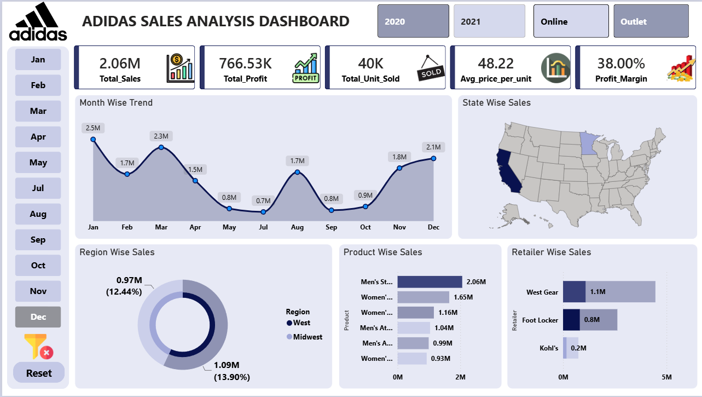

# Adidas Sales Analysis Dashboard

## Project Overview

This Power BI dashboard provides a comprehensive analysis of Adidas sales performance across different regions, states, retailers, products, and sales channels.
The dashboard helps stakeholders monitor sales trends, profitability, product performance, and regional contributions to support data-driven decision making.
---
## Business Problem
Adidas management requires a centralized dashboard to:
- Track total sales and profit
- Monitor monthly sales trends
- Identify top-performing products
- Compare retailer performance
- Analyze regional and state-wise sales
- Evaluate profit margins
---
## Dashboard KPIs

| KPI | Value |
|------|--------|
| Total Sales | 2.06M |
| Total Profit | 766.53K |
| Units Sold | 40K |
| Avg Price Per Unit | 48.22 |
| Profit Margin | 38% |
---
## Dashboard Features

### Sales KPIs

- Total Sales
- Total Profit
- Total Units Sold
- Average Price per Unit
- Profit Margin

### Trend Analysis
- Month-wise Sales Trend

### Geographic Analysis
- State-wise Sales Map
- Region-wise Sales Distribution

### Product Analysis
- Best Selling Products
- Product Performance Comparison

### Retailer Analysis
- Retailer-wise Sales Comparison

### Filters
- Year Filter
- Sales Method Filter
- Month Filter
---
## Tools Used

- Power BI
- Excel
- Power Query
- DAX
---
## Key Insights

1. Peak sales observed in January and March.
2. Sales declined during May-July.
3. Significant recovery observed during November-December.
4. West region contributed the highest revenue.
5. Men's Street Footwear generated the highest sales.
6. West Gear was the top-performing retailer.
---

## Repository Structure

```text
Dashboard/
Dataset/
Documentation/
Images/
README.md
